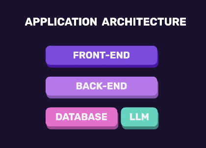

# Aiapp

To install dependencies:

```bash
bun install
```

To run:

```bash
bun run index.ts
```

This project was created using `bun init` in bun v1.3.14. [Bun](https://bun.com) is a fast all-in-one JavaScript runtime.

## Ai Powered Apps

### we will use

1. bun
2. express.js
3. React
4. Tailwind
5. shadcn/ui

### AI Enginering

#### Ai Engineering != Ml engineering

Ai Engineering is to use pre trained models to make our applications smarters

### what are large language models ?

- it is a system that is trained to understand and generate human language

### what we can do with llms


